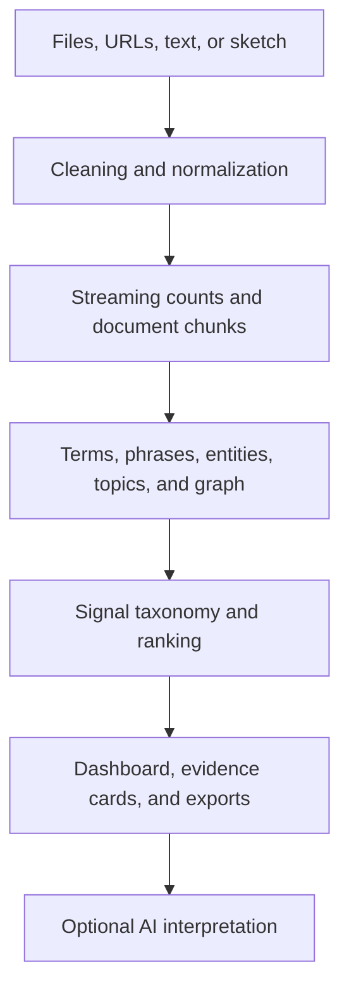

<div align="center">

# Signal Foundry

### Computational sensemaking for complex, unstructured text

Turn reports, transcripts, datasets, presentations, public webpages, and large offline text collections into interpretable signals without treating automated analysis as a substitute for human judgment.

[](https://www.python.org/)
[](https://streamlit.io/)
[](LICENSE)
[](#known-limitations)
[](https://github.com/peristron/signalfoundry_v3/issues)
[](https://github.com/peristron/signalfoundry_v3/pulls)

[Overview](#overview) · [Capabilities](#capabilities) · [Quick start](#quick-start) · [Privacy](#privacy-and-data-handling) · [Methods](#analytical-foundations) · [Feedback](#feedback-questions-and-contributions)

</div>

---

## Overview

Signal Foundry is a Streamlit-based text-analysis and computational-sensemaking application. It converts unstructured or semi-structured text into an inspectable analytical sketch containing recurring terms, distinctive vocabulary, associated phrases, hidden topics, entity-like names, relationship graphs, maturity indicators, evidence cards, and optional AI-assisted synthesis.

The application is designed to help a human analyst understand the shape of a resource or corpus:

- What appears often?
- What is distinctive rather than merely frequent?
- Which ideas travel together?
- What themes, tensions, risks, constraints, or opportunities may be emerging?
- Which expected concepts are present, weak, or absent?
- Which excerpts deserve closer human review?

> [!IMPORTANT]
> Signal Foundry is an exploratory analysis and evidence-organization tool. Its outputs are structured leads, not verified facts, final conclusions, or substitutes for domain expertise.

### Feedback is welcome

The easiest way to ask a question, report a problem, suggest an improvement, or provide general feedback is to [open a GitHub Issue](https://github.com/peristron/signalfoundry_v3/issues/new). If you have a concrete code or documentation change, please submit a [pull request](https://github.com/peristron/signalfoundry_v3/pulls).

## Why Signal Foundry?

Text-heavy analysis often begins with material that is too large, inconsistent, repetitive, or poorly structured for a quick human review. Signal Foundry provides a layered first pass that helps an analyst move from raw text to:

1. a high-level corpus fingerprint;
2. ranked statistical and heuristic signals;
3. representative evidence for human inspection;
4. optional comparisons across groups or time;
5. downloadable artifacts for further analysis or calibration.

It is especially useful for:

- meeting and interview transcripts;
- research papers and reports;
- strategy, policy, and planning documents;
- support cases, survey responses, and feedback collections;
- client notes and implementation records;
- CSV- and Excel-based text datasets;
- large or sensitive datasets processed through the offline harvester.

## Capabilities

### Supported inputs

| Input | Current support | Important notes |
|---|---:|---|
| CSV | Supported | Select one or more text columns and optional date/category columns. Batch mode uses the first detected column as a safe default. |
| Excel `.xlsx`, `.xlsm` | Supported | Select a worksheet, indicate whether it has a header, preview the data, and choose text/date/category columns. Batch mode uses the first named column of the first worksheet. Macros are not executed. |
| Plain text `.txt` | Supported | Common UTF-8, UTF-8 BOM, and UTF-16 text/transcript encodings are detected. |
| WebVTT `.vtt`, SubRip `.srt` | Supported | Transcript timestamps, cue identifiers, speaker labels, and selected speakers can be cleaned or excluded. |
| PDF `.pdf` | Supported for embedded text | Image-only or scanned PDFs require OCR before upload. |
| PowerPoint `.pptx` | Supported for text frames | Extracts text from slide shapes; embedded images and charts are not interpreted. |
| JSON / JSONL `.json` | Supported | Line-delimited objects can be scanned using an optional text-field key. |
| Harvester sketch `.json` | Supported | Must match the Signal Foundry sketch schema. Evidence excerpts may be present unless the sketch was created with `--no-evidence`. |
| Pasted text | Supported | Useful for notes, excerpts, and ad hoc analysis. |
| Public webpage URLs | Basic support | Best for static, publicly accessible pages. JavaScript-rendered, authenticated, restricted, or paywalled pages may not work. |

> [!NOTE]
> Legacy `.xls` workbooks are not supported. Convert them to `.xlsx`, `.xlsm`, or CSV before scanning.

### Analysis outputs

| Output | What it helps answer |
|---|---|
| Executive Signal Dashboard | What is the corpus size, evidence coverage, signal mix, and recommended next step? |
| Signal Compass | Which broad analytical forces have the strongest directional pull? |
| Resource Shape | What does the combination of top-ranked signals suggest about the corpus? |
| Supporting Insight Cards | What evidence, confidence, context, and follow-up question support each analytical lead? |
| Word Cloud and Corpus Statistics | Which terms dominate, and does the cleaned vocabulary look sensible? |
| Theme Evidence Cards | Which associated phrases and distinctive terms may represent useful themes? |
| Frequency vs. Distinctiveness Quadrant | Which terms are core signals, common backdrop, niche signals, or low-evidence terms? |
| Hypothesis / Concept Check | Are analyst-supplied expected concepts present, weak, or absent? |
| Contrastive Analysis | Which terms distinguish one category or stakeholder group from another? |
| Temporal Drift and Trends | Which terms are rising, fading, or changing over time? |
| Entity-like Extraction | Which capitalized names, acronyms, identifiers, or named concepts recur? |
| TF-IDF-style Term Distinctiveness | Which terms are unusually specific across the application’s synthetic document chunks? |
| LDA or NMF Topic Modeling | Which latent word groups may exist beneath the visible term counts? |
| Network Graph | Which terms co-occur, which concepts are central, and where do clusters form? |
| Optional Sentiment View | How do positive and negative term signals distribute under the selected thresholds? |
| Maturity Assessment | Which maturity-stage vocabularies appear in source material that fits a selected lens? |
| Optional AI Analyst | What higher-level synthesis can be produced from the derived statistical context brief? |

### Exports

Depending on the active analysis, Signal Foundry can produce:

- CSV files for insight cards, themes, expected concepts, comparisons, trends, key terms, phrases, entities, and related tables;
- combined word-cloud PNG images;
- GEXF network files for tools such as Gephi;
- hybrid heatmap/QR signature PNG files;
- maturity-assessment JSON snapshots;
- password-gated calibration ZIP packages containing CSV, JSON, and Markdown diagnostics.

## How it works



Raw source text is cleaned and transformed into counts, document-frequency information, adjacent-term relationships, entity-like candidates, retained evidence snippets, and optional metadata groupings. The Insight Engine then combines statistical signals with heuristic classification and ranking to produce an analyst-facing map.

## Recommended workflow

1. Decide whether the next scan should clear the existing session or add to it.
2. Configure cleaning, stopwords, transcript handling, and document granularity.
3. Upload files, paste text or URLs, or load an offline sketch.
4. For structured CSV or Excel data, select text, date, and category columns.
5. Run the scan.
6. Start with the Executive Signal Dashboard.
7. Read Signal Compass and Resource Shape.
8. Inspect Supporting Insight Cards and their representative evidence.
9. Review the Word Cloud and top terms for boilerplate or cleaning problems.
10. Use Themes, Entities, Distinctive Terms, Trends, and Graphs as needed.
11. Use a maturity lens only when the source material matches its intended domain.
12. Use the AI Analyst after the visible outputs look reasonable.
13. Use Calibration Export when comparing runs or tuning the analysis.

> [!CAUTION]
> New scans are additive unless **Clear previous data** is enabled. Re-scanning the same source in additive mode can duplicate its contribution.

## Quick start

### Requirements

- Python 3.10 or newer
- `pip`
- the dependencies listed in `requirements.txt`

### 1. Clone the repository

```bash
git clone https://github.com/peristron/signalfoundry_v3.git
cd signalfoundry_v3
```

### 2. Create a virtual environment

<details>
<summary><strong>Windows PowerShell</strong></summary>

```powershell
python -m venv .venv
.\.venv\Scripts\Activate.ps1
```

</details>

<details>
<summary><strong>macOS or Linux</strong></summary>

```bash
python3 -m venv .venv
source .venv/bin/activate
```

</details>

### 3. Install dependencies

```bash
python -m pip install --upgrade pip
pip install -r requirements.txt
```

### 4. Configure optional secrets

Create `.streamlit/secrets.toml` if you want to unlock the AI Analyst or calibration tools:

```toml
# Password that unlocks AI and calibration features.
auth_password = "replace-with-a-strong-password"

# Add only the providers you intend to use.
deepseek_api_key = "replace-with-your-key"
xai_api_key = "replace-with-your-key"
openai_api_key = "replace-with-your-key"
```

> [!WARNING]
> Never commit real API keys or passwords. Keep `.streamlit/secrets.toml` out of version control.

Core scanning and most analytical views do not require authentication. The password unlocks provider settings, the AI Analyst, and calibration exports; it is not a full application access-control layer.

### 5. Run the application

```bash
streamlit run mainapp.py
```

Streamlit will print a local URL, normally `http://localhost:8501`.

### Basic validation

After a significant code change:

```bash
python -m py_compile mainapp.py harvester.py text_processor.py
streamlit run mainapp.py
```

Then perform one direct scan and one offline-harvester scan.

## Usage paths

### Path A: Standard interactive scan

Best for most users.

1. Open **Analyze Documents**.
2. Configure cleaning and scan settings in the sidebar.
3. Upload one or more supported files, paste text, or paste public URLs.
4. Expand the configuration panel for any structured CSV or Excel file.
5. Start the individual or batch scan.
6. Review the dashboard in the recommended reading order.

### Path B: Structured CSV or Excel analysis

Use this path when the dataset has meaningful columns.

1. Upload a CSV, XLSX, or XLSM file.
2. Expand its configuration panel.
3. For Excel, select the worksheet and indicate whether the first row is a header.
4. Select one or more text columns.
5. Review the optional Excel preview when applicable.
6. Optionally select:
   - a date column for trends and temporal drift;
   - a category column for group comparisons.
7. Scan the file individually.

Batch scanning intentionally uses the first detected CSV column or the first named column of the first Excel worksheet. Scan structured files individually when you need explicit column, date, category, worksheet, or header control.

### Path C: Meeting transcripts

1. Upload a VTT, SRT, or transcript-style TXT file.
2. Enable **Transcript Cleanup Mode** before scanning.
3. Keep **Strip speaker labels from analyzed text** enabled unless names are analytically important.
4. Keep **Drop very short filler utterances** enabled for a first pass.
5. Select detected speakers, or enter labels manually, when complete utterances should be excluded.
6. Leave partial speaker matching disabled unless broader matching is intentional.
7. Start with a **Rows per Doc** value between 1 and 5.

Transcript cleanup can remove or reduce:

- timestamps and caption cues;
- VTT and SRT cue identifiers;
- transcript system messages;
- speaker prefixes;
- short acknowledgements and filler utterances;
- selected speakers’ complete contributions.

### Path D: Offline harvester

Use the harvester for large datasets or environments where raw source material should remain outside the hosted app.

Basic example:

```bash
python harvester.py --input data.csv --col text --output sketch.json
```

Include temporal and category summaries:

```bash
python harvester.py --input data.csv --col text --date-col date --category-col team --output sketch.json
```

Exclude representative excerpts:

```bash
python harvester.py --input data.csv --col text --output sketch.json --no-evidence
```

Upload the resulting JSON under **Load Offline Analysis (Harvester)**.

> [!IMPORTANT]
> Offline processing does not automatically make a sketch anonymous. Without `--no-evidence`, the sketch may contain representative source excerpts. Counts, phrases, entities, categories, and other derived metadata may also reveal sensitive information.

### Path E: Data Refinery

The Data Refinery can split a very large CSV into smaller ZIP-packaged CSV files.

Use it only after sanitizing the source. It is a file-preparation utility, not an anonymization system.

## Reading the results

### Recommended reading order

1. **Executive Signal Dashboard**  
   Confirm corpus size, evidence coverage, strongest signals, and suggested next steps.

2. **Signal Compass**  
   Review the main directional pull of the material.

3. **Resource Shape**  
   Read the short synthesis assembled from the strongest signal families.

4. **Supporting Insight Cards**  
   Inspect signal type, contextual role, confidence, ranking rationale, representative evidence, interpretation, and follow-up question.

5. **Word Cloud & Stats**  
   Check whether boilerplate, headers, names, or transcript artifacts dominate.

6. **Themes, Entities, Distinctive Terms, Trends, and Graphs**  
   Use deeper views to test and refine the first-pass interpretation.

7. **Maturity**  
   Apply only when the source material is suitable for the selected lens.

8. **AI Analyst**  
   Use last, after checking that the derived context is sensible.

### Interpretation boundaries

Signal Foundry can help surface:

- repeated and distinctive language;
- associated words and phrases;
- candidate themes and latent topics;
- entity-like names and identifiers;
- possible needs, tensions, risks, constraints, and opportunities;
- weak or missing expected concepts;
- representative evidence for review.

It cannot guarantee:

- author intent;
- factual truth;
- causal explanation;
- completeness;
- unbiased classification;
- legal, medical, scientific, policy, or organizational correctness.

## Privacy and data handling

Signal Foundry is designed to minimize unnecessary raw-text exposure, but it should not be treated as an anonymization or secure-data-classification system.

### Application processing

- The application processes uploaded content in the active Streamlit session.
- The code does not intentionally write ordinary uploaded source documents to durable application storage.
- The Data Refinery temporarily writes CSV chunks while building its downloadable ZIP.
- Up to 10,000 representative evidence snippets may be retained in session memory.
- Each retained evidence excerpt is capped at approximately 700 characters.
- Session behaviour and infrastructure-level logging or retention remain subject to the hosting environment.

### AI Analyst boundary

The AI Analyst does **not** receive the complete raw source documents or the representative evidence excerpts used in the visible insight cards.

It receives a derived context brief that may include:

- corpus statistics;
- top terms and bigrams;
- entity-like names;
- Signal Compass values;
- Resource Shape synthesis;
- signal labels, roles, confidence, and interpretations;
- graph/community summaries;
- maturity results;
- the user’s question.

The exact context can be inspected in **What the AI can see** before requesting a response.

> [!CAUTION]
> Derived metadata is not necessarily anonymous. Names, organizations, technical terms, categories, and sensitive concepts can remain visible in the AI context brief.

### Calibration exports

Two password-gated export modes are available:

- **Safe calibration export:** excludes representative evidence from the insight-card CSV.
- **Full diagnostic export:** includes evidence snippets and should be handled as potentially sensitive source-derived material.

Always inspect exported files before sharing them.

## Maturity models

Maturity scoring compares cleaned terms and adjacent phrases against configurable domain vocabularies.

| Lens | Structure | Intended use |
|---|---|---|
| EdTech & LMS Operations | Five levels | Directional review of LMS use, integration, analytics, governance, and optimization language |
| General Business Operations | Five levels | Directional review from reactive practices through standardized, measured, and optimizing operations |
| Policy & Governance | Five levels | Directional review from enforcement/reactive language through evidence-based and systemic governance |
| TAM Maturity Model | Twelve domains, three tiers | Multi-domain administrative maturity review with domain radar, details, exports, and longitudinal snapshots |

> [!IMPORTANT]
> Maturity results measure vocabulary present in the supplied material. They do not independently verify actual organizational capability, performance, adoption, or maturity.

Cleaning choices affect maturity results. Domain vocabulary is protected from generic stopword removal, but custom stopwords, source selection, document granularity, and corpus composition can still influence scoring.

## Analytical foundations

<details>
<summary><strong>1. Cleaning, normalization, and tokenization</strong></summary>

Signal Foundry converts uploaded material into analyzable text and then applies configurable cleaning. Options include:

- chat-artifact removal;
- HTML removal and entity unescaping;
- URL and email removal;
- integer removal;
- minimum token length;
- hyphen and apostrophe handling;
- generic and custom stopwords;
- optional lemmatization;
- transcript-specific cleanup and speaker exclusion.

All downstream outputs depend on the resulting cleaned token stream.

</details>

<details>
<summary><strong>2. Frequency and corpus statistics</strong></summary>

The application counts cleaned terms and tracks document-like units assembled according to **Rows per Doc**. These counts support the word cloud, top-term tables, lexical-diversity estimate, graph, maturity models, and several ranking features.

Frequency answers:

> What appears most often after cleaning?

</details>

<details>
<summary><strong>3. Phrase association with NPMI</strong></summary>

Normalized Pointwise Mutual Information estimates how strongly adjacent word pairs are associated relative to their individual frequencies. A minimum observed frequency is applied to reduce extremely rare pairings.

Every NPMI view derives its denominator consistently from the active unigram token counts. This keeps the auto-generated signal report, theme cards, calibration export, and frequency-table view aligned for the same active vocabulary.

NPMI is used directionally to answer:

> Which adjacent terms appear together more strongly than their separate frequencies would suggest?

NPMI should be interpreted alongside support counts. A high association score with limited evidence is not automatically a central theme.

</details>

<details>
<summary><strong>4. TF-IDF-style term distinctiveness</strong></summary>

Signal Foundry uses a simplified sketch-oriented term score based on:

- global term frequency;
- document frequency across synthetic document chunks;
- a smoothed inverse-document-frequency adjustment.

Only terms appearing in more than one document chunk are considered. The smoothed calculation avoids negative IDF values when a term appears throughout the retained document set. This is a custom directional implementation rather than a full phrase-extraction pipeline.

It helps answer:

> Which terms are comparatively distinctive across the current document chunks?

</details>

<details>
<summary><strong>5. Topic modeling with LDA and NMF</strong></summary>

When enough synthetic documents and vocabulary are available, Signal Foundry can fit:

- **Latent Dirichlet Allocation (LDA)** for probabilistic topic mixtures;
- **Non-Negative Matrix Factorization (NMF)** for additive topic components.

NMF is often easier to interpret for shorter, cleaner records. LDA can be useful for longer or more mixed document chunks. Topic labels are represented by their strongest terms and require human interpretation.

</details>

<details>
<summary><strong>6. Entity-like extraction</strong></summary>

Entity extraction is regex-based rather than a trained named-entity-recognition model. It identifies patterns such as:

- uppercase acronyms;
- capitalized multi-word names;
- capitalized identifiers containing numbers or hyphens.

Results may include false positives, headings, or source artifacts. Treat the output as named-entity-style candidates for review.

</details>

<details>
<summary><strong>7. Signal taxonomy and semantic families</strong></summary>

The Insight Engine uses several related heuristic layers.

Primary signal types include:

- Pain / Friction
- Need / Request
- Blocker / Constraint
- Aspiration / Opportunity
- Risk / Concern
- Decision / Tradeoff
- Contradiction / Tension

Additional semantic families can identify patterns such as:

- Infrastructure / System Dependence
- Embodiment / Lived Experience
- Isolation / Disconnection
- Authority / Legitimacy
- Evidence / Experiment
- Disease / Hazard
- Intervention / Control Method
- Public Health / Institutional Response
- Risk / Failure Mode
- Standardization / Loss of Difference
- Institutional Structure / Social Design
- Motif / Image Pattern

These classifications are heuristic organizational aids, not definitive semantic labels.

</details>

<details>
<summary><strong>8. Interpretive Lift, signal roles, and evidence cards</strong></summary>

Interpretive Lift is a custom directional ranking heuristic. It considers ingredients such as:

- evidence strength;
- distinctiveness;
- semantic fit;
- phrase quality;
- contextual role;
- signal type;
- confidence;
- qualification or contrast cues.

Signals may then be assigned roles such as:

- Core Insight
- Supporting Signal
- Qualified / Contrast
- Supporting Motif
- Context / Reference
- Low-Specificity

The score is intended to make ranking decisions inspectable. It is not a validated statistical probability or universal measure of importance.

</details>

<details>
<summary><strong>9. Qualification and contrast detection</strong></summary>

The application looks for contextual cues indicating that a concept may be rejected, limited, contrasted, or used only as comparison. Examples include “not,” “rather than,” “instead,” and similar qualifying constructions.

This layer reduces, but cannot eliminate, the risk of treating a mentioned idea as an endorsed or central claim.

</details>

<details>
<summary><strong>10. Network analysis</strong></summary>

The graph is built from term co-occurrence relationships:

- nodes represent terms;
- edges represent observed relationships;
- edge weights reflect relationship frequency;
- graph controls can filter nodes and links;
- GEXF export supports deeper analysis outside the browser.

In-browser rendering is capped at 90 nodes and 180 edges for stability.

</details>

<details>
<summary><strong>11. Optional sentiment inference</strong></summary>

When enabled, VADER assigns sentiment scores to terms and bigrams. Signal Foundry then uses positive and negative evidence counts in a beta-distribution update to display a directional positive-rate estimate and interval.

This is best suited to opinion-rich text. It is less informative for neutral technical corpora, and term-level sentiment can miss negation, irony, and sentence context.

</details>

<details>
<summary><strong>12. Optional AI synthesis</strong></summary>

The AI Analyst sends the derived context brief through an OpenAI-compatible chat-completions interface. The current application offers provider settings for DeepSeek, xAI, and OpenAI.

The AI is instructed to:

- use only the supplied context brief;
- distinguish evidence from interpretation;
- avoid claiming to have read the raw source documents;
- acknowledge when the available context cannot answer a question.

AI output remains probabilistic and requires human review.

</details>

## Calibration exports

Calibration exports are intended for repeated testing, tuning, and transparent review of the ranking process.

A package can include:

- run settings and summary metadata;
- insight cards;
- Resource Shape summary and signal families;
- Resource Shape weighting diagnostics;
- signal-type and signal-role distributions;
- corpus statistics;
- top terms and bigrams;
- NPMI tables;
- TF-IDF-style distinctive-term tables (`tfidf_keyphrases.csv` is retained as the established export filename);
- entities;
- evidence snippets when full export is selected;
- explanatory calibration notes.

Useful applications include:

- comparing repeat scans;
- reviewing why a signal ranked highly;
- tuning stopwords and cleaning settings;
- documenting test snapshots;
- checking the effect of calibration changes.

## Known limitations

- Signal Foundry is primarily English-oriented.
- Excel analysis reads cell values, not charts, images, comments, or macro code. Macros in `.xlsm` files are not executed.
- Formula cells depend on cached workbook values. Recalculate and save the workbook in Excel first if current formula results are important.
- PDF extraction does not perform OCR.
- URL extraction does not execute JavaScript or bypass authentication and access controls.
- Entity extraction is pattern-based and is not equivalent to a trained NER model.
- TF-IDF is a simplified, sketch-oriented unigram score.
- Topic models produce candidate word groups, not authoritative theme labels.
- Sentiment is primarily term-level and can miss sentence context.
- Maturity models detect matching language, not verified real-world capability.
- Evidence snippets are capped at 10,000 retained records and approximately 700 characters each.
- Topic-document retention is capped to protect memory.
- Browser graph rendering is capped at 90 nodes and 180 links.
- The application checks for files larger than 1,024 MB, but the hosting platform may impose a lower effective upload or memory limit.
- Hosted sessions can reset, expire, or restart; download important outputs before leaving the session.
- Cost estimates are indicative and may not reflect current provider pricing.
- Some analysis settings reset existing data to maintain internal consistency.

## Troubleshooting

<details>
<summary><strong>The application starts, but a feature is unavailable</strong></summary>

Open **System Health** in the sidebar. Optional features depend on packages such as NLTK, SciPy, scikit-learn, Beautiful Soup, `pypdf`, `python-pptx`, `qrcode`, and `openpyxl`.

Confirm that installation completed successfully:

```bash
pip install -r requirements.txt
```

</details>

<details>
<summary><strong>An Excel scan is empty or incomplete</strong></summary>

- Scan the workbook individually rather than through batch mode.
- Confirm the selected worksheet.
- Confirm whether **Has Header Row** matches the workbook.
- Select at least one text column.
- Check the five-row preview before scanning.
- Recalculate and save formula-heavy workbooks in Excel so cached values are available.
- Remember that charts, images, comments, and VBA macros are not analyzed.

If the workbook remains difficult to interpret, save the relevant worksheet as CSV and scan that file.

</details>

<details>
<summary><strong>A PDF produces little or no text</strong></summary>

The PDF may be scanned or image-based. Apply OCR before uploading it. Password-protected or malformed PDFs may also fail extraction.

</details>

<details>
<summary><strong>A webpage URL returns no usable text</strong></summary>

Confirm that the page:

- is public;
- uses `http` or `https`;
- does not require authentication;
- contains server-rendered text;
- is not primarily JavaScript-rendered.

If needed, copy the relevant text and use **Manual Text Paste**.

</details>

<details>
<summary><strong>Top terms are dominated by boilerplate or names</strong></summary>

- Add recurring artifacts to custom stopwords.
- Enable transcript cleanup for meeting exports.
- Exclude irrelevant speakers.
- Confirm that the correct CSV or Excel text column was selected.
- Re-scan with **Clear previous data** enabled.

</details>

<details>
<summary><strong>Topic modeling is unavailable or unhelpful</strong></summary>

- Scan more document-like units.
- Adjust **Rows per Doc**.
- Try NMF for shorter records and LDA for longer mixed documents.
- Reduce the requested number of topics if topics are repetitive.
- Improve cleaning and stopwords before interpreting the results.

</details>

<details>
<summary><strong>The graph is empty, disconnected, or unreadable</strong></summary>

- Lower the minimum link frequency to reveal weaker connections.
- Raise it to remove noise.
- Reduce maximum nodes and links.
- Adjust repulsion or edge length.
- Disable physics if browser rendering becomes unstable.
- Export GEXF for deeper graph analysis.

</details>

<details>
<summary><strong>Trends or comparisons do not appear</strong></summary>

Scan a CSV or Excel file individually and select valid date and category columns. Trends require parseable dates; contrastive analysis requires at least two categories.

</details>

<details>
<summary><strong>The AI Analyst is unavailable</strong></summary>

Confirm that:

- `auth_password` is configured;
- you have unlocked the AI section;
- the selected provider has a valid API key;
- the configured model is available to that provider account.

Core analytics do not require AI access.

</details>

## Repository structure

```text
signalfoundry_v3/
├── .devcontainer/          # Development-container configuration
├── .streamlit/             # Streamlit configuration
├── DEPLOYMENT_NOTES.md     # Deployment-specific guidance
├── LICENSE                 # MIT License
├── README.md               # Project documentation
├── harvester.py            # Offline large-dataset preprocessing
├── mainapp.py              # Main Streamlit application
├── requirements.txt        # Python dependencies
└── text_processor.py       # Shared text-processing utilities
```

Do not commit `.streamlit/secrets.toml` or any file containing real credentials.

## Development guidance

Recommended checks after significant changes:

- compile the Python entry points;
- start the Streamlit application from a clean environment;
- scan a representative CSV or TXT file;
- test a text-based PDF and PowerPoint;
- test VTT and SRT transcript cleanup and speaker exclusion;
- test category and date analysis with structured CSV and Excel files;
- compare NPMI values across the signal report, theme cards, table view, and calibration export;
- confirm that calibration packages retain the established `tfidf_keyphrases.csv` filename;
- generate at least one CSV, PNG, GEXF, JSON, and calibration ZIP export;
- test offline sketch generation and loading;
- test both additive and clear-on-scan behaviour;
- test authenticated and unauthenticated views;
- inspect the AI-context preview before testing each provider.

When the application stabilizes further, useful engineering improvements include:

- adding OCR as an optional preprocessing path;
- expanding automated reader, calculation, and interface tests;
- adding continuous integration for compilation and regression checks;
- adding sanitized sample corpora and expected-output fixtures;
- making provider model identifiers and cost assumptions easier to update.

## Project status and affiliation

This is my own independent project. It is not affiliated with, endorsed by, sponsored by, or developed on behalf of my employer or any other organization.

Signal Foundry uses open-source libraries under their applicable licences. References to third-party products, providers, or platforms are descriptive and do not imply endorsement or affiliation.

## Feedback, questions, and contributions

Questions, feedback, suggestions, bug reports, and focused pull requests are welcome (and yes, I already know this code-base is too monolithic~).

| If you want to... | Recommended GitHub route |
|---|---|
| Ask a question about the application | [Open an Issue](https://github.com/peristron/signalfoundry_v3/issues/new) |
| Report a bug or unexpected result | [Open an Issue](https://github.com/peristron/signalfoundry_v3/issues/new) |
| Suggest a feature, workflow, or documentation improvement | [Open an Issue](https://github.com/peristron/signalfoundry_v3/issues/new) |
| Propose a specific code or documentation change | [Submit a Pull Request](https://github.com/peristron/signalfoundry_v3/pulls) |

For a substantial change, opening an Issue first is recommended so the proposed direction can be discussed before implementation.

When reporting a problem, please include:

- the input format;
- the relevant settings;
- whether the scan was individual or batch;
- whether data was cleared or added;
- the expected and observed result;
- a sanitized example when possible.

> [!CAUTION]
> Do not include confidential source material, API keys, passwords, personal information, client-identifiable content, or private evidence excerpts in Issues or pull requests.

## License

Signal Foundry is available under the [MIT License](LICENSE).

## Maintainer note

Signal Foundry is built around a simple principle:

> Preserve raw text only when needed, convert it into inspectable mathematical signal as early as practical, and make every output understandable enough for a human analyst to challenge.
